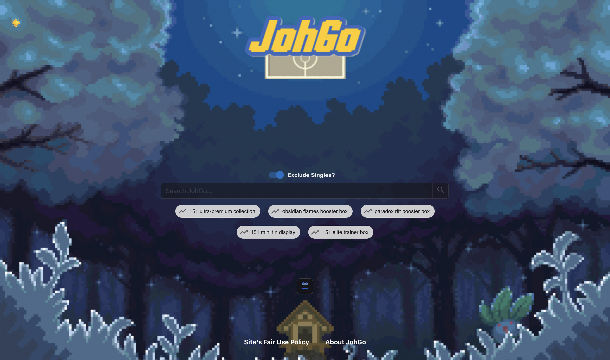
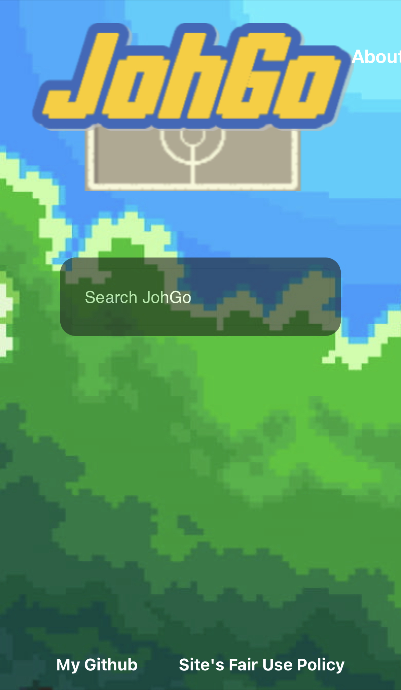

 

 

      

# About
  
JohGo is a free, open-source, search engine for UK Pokémon TCG products. I had the idea whilst trawling through endless
Google pages of out of stock products. Written with a mix of React/Go, it utilises ElasticSearch to hold the data from
the scrapes.

- [View the site here!](https://johgo.xyz)
- Currently scraping 70~ UK sites returning on average 12000-13000 products
- Filters out most mystery box/joblot garbage on the backend with the option to filter out single cards.
- Gets top trending search terms from the web.
- Feel free to use as a blueprint for your own project!
 
 
 

 

## Running JohGo 
See below how to launch JohGo in a development environment.
 

  
Frontend

  
  1. Clone repo
  2. Configure Npm
     * [Install NPM (If not already done)](https://docs.npmjs.com/downloading-and-installing-node-js-and-npm)
     * `npm install` - Install packages for JohGo
     * `npm start` - Run JohGo in development mode

 

# Contributing

## Reporting an issue
**If you encounter a problem with the project or have a suggestion for improvement, please create an issue on our GitHub repository or email me at johgo.search@gmail.com. To create a new issue, follow these steps**:

  
Report an issue

  
1. Go to the Issues section of the repository.
2. Click the "New Issue" button.
3. Give your issue a descriptive title and **provide as much detail as possible in the description**.
4. If possible, include steps to reproduce the issue or a sample code snippet.
5. Add any relevant labels and/or assignees.
Click "Submit new issue".

 

## Pull requests

If you would like to contribute code to the project, we welcome pull requests on frontend issues. To make a pull request, follow these steps:

  
Make a pull request

  
1. Fork the repository.
2. Clone your forked repository to your local machine.
3. Create a new branch for your changes.
4. Make your changes and commit them with a descriptive message.
5. Push your changes to your forked repository.
6. Create a pull request on our repository.
7. Provide a descriptive title and detail what changes you made.
8. **Be sure to reference the issue number in order to have the PR accepted**.
9. Wait for the project maintainers to review your pull request.

 

 

Important links & references

- [Elastic/Docker installation guide](https://www.elastic.co/guide/en/elasticsearch/reference/current/docker.html)
- [go-elasticsearch](https://github.com/elastic/go-elasticsearch/)
- [go.dev](https://go.dev/)
- [go-chi](https://github.com/go-chi/chi)